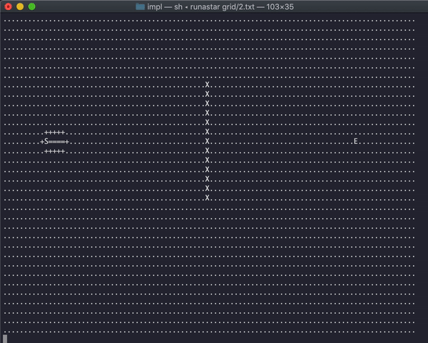

# Quickgrid

Implement and visualize pathfinding algorithms using C++

The goal of this project was to build a boilerplate where a pathfinding algorithm can be implemented quickly and visualize directly in the terminal with a user-provided grid layout.

Input grids here are stored in .txt files located in _**src/grids/**_

The code for pathfinding algorithms are located in _**src/pathfinders/**_

Here's a demo of A* algorithm running on a given grid with obstacles between the start and end node:

